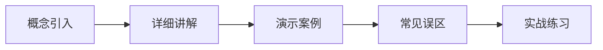

# Gamma PPT 文案模板

生成 PPT 文案时，使用以下 Markdown 结构。Gamma 通过 `---` 识别分页（每个 `---` 之间为一张卡片/幻灯片）。

## 输出格式规范

- 每张卡片用 `---` 分隔
- 每张卡片以 `##` 标题开头
- 正文使用项目符号、粗体标注、表格、代码块、Mermaid 图
- 每张卡片聚焦一个主题，内容不超过 150 字（避免幻灯片过于拥挤）
- 首张卡片为封面，末张为总结

## 模板结构

```markdown
# 课程标题

---

## 封面

**课程名称**：XXX
**讲师**：Wayne 老师
**课程定位**：一句话说明本节课解决什么问题

---

## 本节概览

本节课将学习：
1. 要点一
2. 要点二
3. 要点三
4. 要点四

**预计时长**：XX 分钟

---

## 知识点一：概念标题

**是什么**：一句话定义

**为什么重要**：
- 理由 1
- 理由 2

**类比理解**：用生活化比喻解释

---

## 知识点一：详细讲解

（根据需要展开，可包含）：

- 对比表格
- 流程图（Mermaid）
- 代码示例
- 截图说明占位符：`[截图：XXX 界面]`

---

## 知识点一：演示案例

**演示场景**：描述具体操作场景

**操作步骤**：
1. 步骤一
2. 步骤二
3. 步骤三

**预期结果**：描述操作后的效果

---

## 知识点二：概念标题

（重复上述"概念 → 详解 → 演示"三卡片结构）

---

## 对比总结

| 维度 | 选项A | 选项B | 选项C |
|------|-------|-------|-------|
| 特性1 | ... | ... | ... |
| 特性2 | ... | ... | ... |
| 适用场景 | ... | ... | ... |

---

## 常见误区

**误区一：XXX**
- 错误做法：……
- 正确做法：……

**误区二：YYY**
- 错误做法：……
- 正确做法：……

---

## 实战练习

| 练习任务 | 使用方式 | 预期效果 |
|---------|---------|---------|
| 任务1 | 操作方法 | 达成目标 |
| 任务2 | 操作方法 | 达成目标 |

---

## 本节总结

**核心要点回顾**：
1. 要点一
2. 要点二
3. 要点三

**关键记忆点**：一句话总结本节最重要的认知

---

## 下节预告

**下节课题**：XXX

**将学习**：
- 预告内容 1
- 预告内容 2

> "下节课，我们就正式开始……"
```

## 内容翔实度要求

PPT 文案虽是幻灯片格式，但内容必须翔实，不能只有标题和空泛的要点。每张卡片需做到：

1. **有概念**：不只列术语，要给出一句话解释
2. **有理由**：说明为什么这个知识点重要
3. **有示例**：附带具体的代码、截图占位或操作场景
4. **有对比**：同类概念用表格或并列结构对比
5. **有行动**：告诉观众具体要做什么

## Mermaid 图使用场景

- **流程图**：适合操作步骤、决策路径
- **时序图**：适合组件间交互
- **对比/分类**：适合用表格替代


